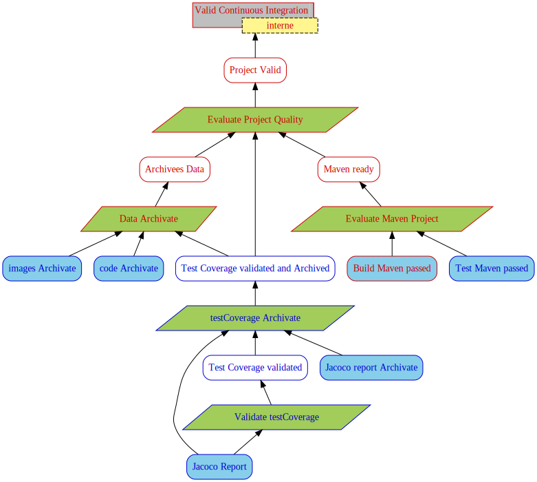

# Justification Diagram Generator

- Author : Corinne Pulgar
- Supervision : Sébastien Mosser

This prototype generates a justification diagram from a text file. 

## Installation

JDGenerator is a Maven program. You can either clone the repo and run the following commands :
```
mvn install
mvn compile
```
<!-- TODO : changed the 'download the jar file' -->
or [download the jar file](https://github.com/ace-design/JustificationDiagram/releases/tag/v1.1).

## Execution
From the cloned repo, run 
```
mvn exec:java -Dexec.mainClass="JDCompiler" -Dexec.args="[INPUT_FILE] -o [OUTPUT_FILE] [OPTIONS] ([INPUT_REALIZATION_FILE] -rea )"

```

or execute the jar file with 
```
java -jar JDGenerator-jar-with-dependencies.jar [INPUT_FILE] -o [OUTPUT_FILE] [OPTIONS] ([INPUT_REALIZATION_FILE] -rea )
```

### Options
| Flag  | Argument | Description                              |
|-------|----------|------------------------------------------|
| -o    | path     | Output file (no extension)               |
| -svg  | -        | Generate visual graph                    |
| -svgR | -        | Generate visual realisation graph        |
| -gv   | -        | Generate text files before dot formating |
| -td   | -        | Generate todo list                       |

If no output file is entered, the generated files will be named from the input file name. 


other examples : 
```
mvn exec:java -Dexec.mainClass="JDCompiler" -Dexec.args="example/basic.jd -o output/images/basic -svg"
```
```
mvn exec:java -Dexec.mainClass="JDCompiler" -Dexec.args="example/basic.jd -o output/images/basic -svg output/realization/realization.txt -rea"
```
```
mvn exec:java -Dexec.mainClass="JDCompiler" -Dexec.args="example/basic.jd -o output/images/basic -svg -td output/realization/realization.txt -rea"

```

## Syntax
The developped syntax strongly ressembles [PlantUML](https://plantuml.com/)'s object and class diagram syntaxes. 

### Tags
The text file should start and end by the corresponding tags.
```
@startuml

' Your code here

@enduml
```
The order of the elements, either declarations or relations, doesn't matter.

### Declarations
Write a declaration to create a node. The expected partern is as follow :
```
<TYPE> <ALIAS> = "<LABEL>"
```
The conclusion and subconclusion may have a restriction field. There can only be one conclusion per diagram.
```
<TYPE> <ALIAS> = "<LABEL>" - "<RESTRICTION>"
```

### Relations
The prototype permits two types of oriented link.

* Expanded link :
```
<ALIAS_1> --> <ALIAS_2>
```
* Collapsed link :
```
<ALIAS_1> ..> <ALIAS_2>
```

## Realization

During the Continuous integration, please add to a file named 'realization.txt' the supports, domains and rationale that have been validated.

For this purpose, in '.github\workflows\maven.yml' add this after the Build and Test of your project and before the generation of diagramm :

```
- name: Realization
      run: echo -e "[Label of the accompliseh task]" >> output/realization/realization.txt
```

You can also specify whether a node needs to check the existence of a certain files or directorys, 

```
- name: Realization
      run: echo -e "[Label of the accompliseh task]!-![file necessery 1];[file necessery 2];|file necessery 3]" >> output/realization/realization.txt
      
<!-- this will chek if 'file necessery 1', 'file necessery 2' and 'file necessery 3' exist -->
```

and you can ask if the number of files in a directory is correct.

```
- name: Realization
      run: echo -e "[Label of the accompliseh task]!-![repertory]/!number!10" >> output/realization/realization.txt
      
<!-- it checks if the "directory" contains 10 files -->

```

You can also add references for a certain node with this

```
- name: Realization
      run: echo -e "[Label of the accompliseh task]!ref!Artifacts1" >> output/realization/realization.txt
      
```

## Artifacts

If you want to save the elements created during the continuous integration, always in your 'maven.yl' file, you can write this at the very end of your file :

```
- name: Archive generated codes
  uses: actions/upload-artifact@v2
  with: 
    name: [Name of your Artifact]
    path: [OUTPUT_FILE]
    
    
<!-- This will save all "OUTPUT_FILE" files in the specified artifact -->
```

if you want to save a specific file, you can write this :

```
- name: Archive generated codes
  uses: actions/upload-artifact@v2
  with: 
    name: Artifact1
    path: realization.txt
    
```

If you want more information about worflows, please [go here](https://help.github.com/en/actions/reference/workflow-syntax-for-github-actions)


## Example without realization
Here's an example of a text file, the graph and the todo list it generates.

run this : 
```
mvn exec:java -Dexec.mainClass="JDCompiler" -Dexec.args="example/fig3.jd -o output/images/fig3 -png -td example/realization/realizationFig3.txt -rea"
```

#### example.jd
```
@startuml

conclusion C = "Software safety validated" - "Internal"
strategy S = "Assess software safety"
domain D = "Internal accreditation"
rationale R = "Credentials for IEC 62304"

subconclusion C1 = "Specifications validated"

subconclusion C2 = "Architecture validated"
strategy S2 = "Review architecture"
support F = "Architecture"

subconclusion C3 = "Safety specifications validated"
strategy S3 = "Assess risk management"
rationale R3 = "Credentials for ISO 14971"
support G = "Risk mitigation plan"

subconclusion C4 = "Risks consistency"
strategy S4 = "Verify consistency"
support H = "Technical specifications"
support I = "Functional specifications"
support J = "Identified risks"

subconclusion C5 = "Feasible hard points"

S --> C
D --> S
R --> S

C1 --> S
H ..> C1
I ..> C1

C2 --> S
S2 --> C2
F --> S2
H --> S2

C3 --> S
C3 --> S2
S3 --> C3
R3 --> S3
J --> S3
G --> S3

C4 --> S3
S4 --> C4
H --> S4
I --> S4
J --> S4

C5 --> S2
H ..> C5

@enduml
```

#### example.svg


> The justification diagram was adapted from _Support of Justification Elicitation: Two Industrial Reports_ by Clément Duffau, Thomas Polacsek and Mireille Blay-Fornarino, 2018.

#### example.todo

_Generated List_
```
Requirements list

[ ]	Identified risks
[ ]	Functional specifications
[ ]	Technical specifications
[ ]	Feasible hard points
[ ]	Specifications validated
[ ]	Risk mitigation plan
[ ]	Architecture
[ ]	Risks consistency
[ ]	Safety specifications validated
[ ]	Architecture validated
-----------------------------------------------
[ ]		Software safety validated
-----------------------------------------------
```

## Example with realization 

Now we will see 2 examples of valid and invalid diagrams.
To do so, we will use the following example for both diagrams.

#### example.jd
```
@startuml

conclusion C = "Valid Continuous Integration" - "interne"
PV --> C

subconclusion PV = "Project Valid" 
strategy SE = "Evaluate Project Quality"
SE --> PV
M --> SE
ASC --> SE
AJS --> SE

subconclusion ASC = "Archivees Data" 
strategy SD = "Data Archivate"
support CA = "code Archivate"
support IA = "images Archivate"

SD --> ASC
AJS --> SD
CA --> SD
IA --> SD

subconclusion M = "Maven ready"
strategy SM = "Evaluate Maven Project"
support TM = "Test Maven passed"
support BM = "Build Maven passed" 
BM --> SM
TM --> SM
SM --> M


subconclusion AJS = "Test Coverage validated and Archived"
strategy SJA = "testCoverage Archivate"
support JA = "Jacoco report Archivate"
JV --> SJA
RJ --> SJA
JA --> SJA
SJA --> AJS

subconclusion JV = "Test Coverage validated"
strategy SJ = "Validate testCoverage"
support RJ = "Jacoco Report"
RJ --> SJ
SJ --> JV

@enduml
```

#### example.svg


## Valid Example with realization 
Here's an example of a text file, the graph and the todo list it generates if you have validate all the evidences.

#### maven.yl - Valid 
You should write this in 'maven.yml' :

```
- name: Realization part1
      run: echo -e "Jacoco Report\ncode Archivate!ref!generatedCode\n" >> realization.txt
- name: Realization part2
      run: echo -e "images Archivate!-!examples/exampleCI/Pattern4CI.jd!ref!images" >> realization.txt
- name: Realization part3
      run: echo -e "Test Maven passed\nBuild Maven passed!-!.github/workflows/!number!1" >> realization.txt
- name: Realization part4
     run: echo -e "\nJacoco report Archivate!ref!jacoco\nValid Continuous Integration!ref!GeneratedJD" >> realization.txt
- name: JD&TODO Generation     
   run : mvn exec:java -Dexec.mainClass="JDCompiler" -Dexec.args="examples/exampleCI/Pattern4CI.jd -o output/GeneratedJD/Pattern4CI -png -td realization.txt -rea"
- name: Archive generated codes
      uses: actions/upload-artifact@v2
      with: 
        name: GeneratedJD
        path: output/GeneratedJD
```

#### realization.txt - Valid 

```
Jacoco Report
code Archivate!ref!generatedCode
images Archivate!-!examples/exampleCI/Pattern4CI.jd!ref!images
Test Maven passed
Build Maven passed!-!.github/workflows/!number!1
Jacoco report Archivate!ref!jacoco
Valid Continuous Integration!ref!GeneratedJD

```


#### example_REA.svg - Valid


#### example.todo - Valid

_Generated List_
```
Requirements list

[X]	code Archivate - references : generatedCode
[X]	Test Maven passed
[X]	Jacoco Report
[X]	images Archivate - references : images
[X]	Jacoco report Archivate - references : jacoco
[X]	Test Coverage validated
[X]	Build Maven passed
[X]	Maven ready
[X]	Test Coverage validated and Archived
[X]	Archivees Data
[X]	Project Valid
-----------------------------------------------
[X]		Valid Continuous Integration - references : GeneratedJD
-----------------------------------------------
```


## Invalid Example with realization 
Here's an example of a text file, the graph and the todo list it generates if you don't have validate 'Build Maven passed' and 'Maven ready'.

#### maven.yl - Invalid
You should write this in 'maven.yml' :

```
- name: Realization part1
      run: echo -e "Jacoco Report!ref!Archi1\ncode Archivate\n" >> realization.txt
- name: Realization part2
      run: echo -e "images Archivate!-!examples/exampleCI/Pattern4CI.jd!ref!images" >> realization.txt
- name: Realization part3
      run: echo -e "Test Maven passed\nData Archivate!-!.github/workflows/!number!0\n" >> realization.txt
- name: Realization part4
     run: echo -e "Jacoco report Archivate\nMaven ready!-!dontExist;dontExist2;dontExist3" >> realization.txt
- name: JD&TODO Generation     
   run : mvn exec:java -Dexec.mainClass="JDCompiler" -Dexec.args="examples/exampleCI/Pattern4CI.jd -o output/GeneratedJD/Pattern4CI -png -td realization.txt -rea"
- name: Archive generated codes
      uses: actions/upload-artifact@v2
      with: 
        name: GeneratedJD
        path: output/GeneratedJD
```

#### realization.txt - Invalid

```
Jacoco Report!ref!Archi1
code Archivate
images Archivate!-!examples/exampleCI/Pattern4CI.jd!ref!images
Test Maven passed
Data Archivate!-!.github/workflows/!number!0
Jacoco report Archivate
Maven ready!-!dontExist;dontExist2;dontExist3
```


#### example_REA.svg - Invalid



#### example.todo - Invalid

_Generated List_
```
Requirements list

[X]	code Archivate
[X]	Test Maven passed
[X]	Jacoco Report - references : Archi1
[X]	images Archivate - references : images
[X]	Jacoco report Archivate
[X]	Test Coverage validated
[ ]	Build Maven passed
[ ]	Maven ready
[X]	Test Coverage validated and Archived
[ ]	Archivees Data
[ ]	Project Valid
-----------------------------------------------
[ ]		Valid Continuous Integration
-----------------------------------------------
```


