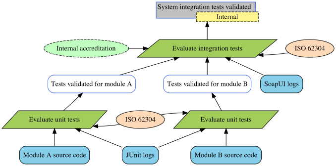

# Justification Diagram Generator

- Author : Corinne Pulgar
- Supervision : Sébastien Mosser

This prototype generates a justification diagram from a text file. 

## Installation

JDGenerator is a Maven program. You can either clone the repo and run the following commands :
```
mvn install
mvn compile
mvn exec:java -Dexec.mainClass="parsing.JDCompiler" -i <INPUT_FILE_NAME> -o <OUTPUT_FILE_NAME>
```

or [download the jar file](https://github.com/ace-design/JustificationDiagram/releases/tag/v1.0) and run :
```
java -jar JDGenerator-jar-with-dependencies.jar -i <INPUT_FILE_NAME> -o <OUTPUT_FILE_NAME>
```

## Syntax
The developped syntax strongly ressembles [PlantUML](https://plantuml.com/). 

### Tags
The text file should start and end by the corresponding tags.
```
@startuml

' Your code here

@enduml
```
The order of the elements, either declarations or relations, doesn't matter.

### Declarations
Write a declaration to create a node. The expected partern is as follow :
```
<TYPE> <ALIAS> = "<LABEL>"
```
The conclusion and subconclusion may have a restriction field. There can only be one conclusion per diagram.
```
<TYPE> <ALIAS> = "<LABEL>" - "<RESTRICTION>"
```

### Relations
At the moment, the prototype permits only one type and one direction of link.
```
<ALIAS_1> --> <ALIAS_2>
```

## Example
Here's an example of a text file and the graph it generates. 
```
@startuml

conclusion C = "System integration tests validated" - "Internal"
strategy S = "Evaluate integration tests"
domain D = "Internal accreditation"
rationale R = "ISO 62304"

support E = "SoapUI logs"

subconclusion CA = "Tests validated for module A"
strategy SA = "Evaluate unit tests"
rationale RAB = "ISO 62304"
support A = "Module A source code"
support J = "JUnit logs"

subconclusion CB = "Tests validated for module B"
strategy SB = "Evaluate unit tests"
support B = "Module B source code"

S --> C
D --> S
R --> S
E --> S
CA --> S
CB --> S
SA --> CA
SB --> CB
RAB --> SA
RAB --> SB
A --> SA
B --> SB
J --> SA
J --> SB

@enduml
```




> The justification diagram was adapted from _Support of Justification Elicitation: Two Industrial Reports_ by Clément Duffau, Thomas Polacsek and Mireille Blay-Fornarino, 2018.


