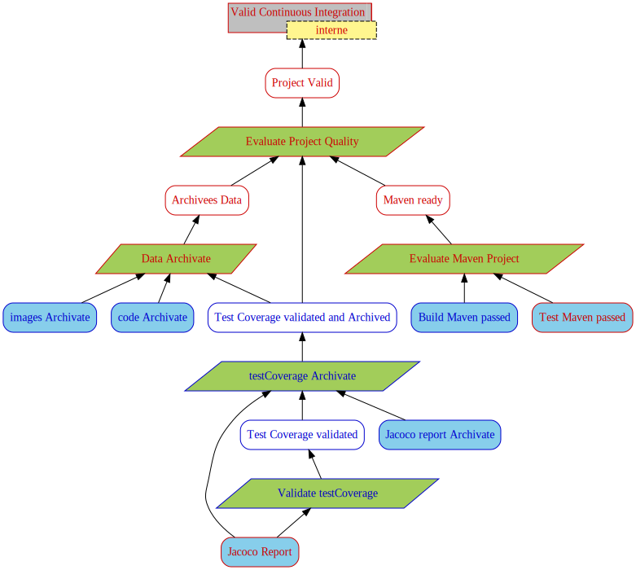

# Justification Diagram Generator
[](https://sonarcloud.io/dashboard?id=MireilleBF_JustificationDiagram)

- Author : Corinne Pulgar and Nicolas Corbière
- Supervision : Sébastien Mosser and Mireille Blay-Fornarino

This prototype generates a justification diagram from a text file. 

## QuickStart

If you want to see the quick start, [go here](https://github.com/Nicolas-Corbiere/TestProjet/blob/master/QuickStart.md).

Or see the test project used [here](https://github.com/Nicolas-Corbiere/TestProjet).

## SonarCloud report 

If you want to see the quality of the project, [see here](https://sonarcloud.io/dashboard?id=MireilleBF_JustificationDiagram).

## Installation

JDGenerator is a Maven program. You can either clone the repo and run the following commands :
```
mvn install
mvn compile
```
or [download the jar file](https://github.com/MireilleBF/JustificationDiagram/releases/tag/V1.2).

## Execution
From the cloned repo, run 
```
mvn exec:java -Dexec.mainClass="JDCompiler" -Dexec.args="[INPUT_FILE] -o [OUTPUT_FILE] (-rea [INPUT_REALIZATION_FILE]) (-act
[INPUT_ACTION_FILE]) [OPTIONS]"

```

or execute the jar file with 
```
java -jar JDGenerator-jar-with-dependencies.jar [INPUT_FILE] -o [OUTPUT_FILE] (-rea [INPUT_REALIZATION_FILE]) (-act [INPUT_ACTION_FILE]) [OPTIONS] 
```

### Options
| Flag  | Argument | Description                              |
|-------|----------|------------------------------------------|
| -o    | path     | Output file (no extension)               |
| -rea  | path     | indicate the realization file            |
| -act  | path     | indicate the action file                 |
| ----- | -------- | ---------------------------------------- |
| -svg  | -        | Generate visual graph                    |
| -svgR | -        | Generate visual realisation graph        |
| -gv   | -        | Generate text files before dot formating |
| -td   | -        | Generate todo list                       |


If no output file is entered, the generated files will be named from the input file name. 


There are a few examples: 
```
mvn exec:java -Dexec.mainClass="JDCompiler" -Dexec.args="example/basic.jd -o output/images/basic -svg"
```
```
mvn exec:java -Dexec.mainClass="JDCompiler" -Dexec.args="justification/example/basic.jd -o output/images/basic -rea output/realization/realization.txt -svg  "
```
```
java -jar DGenerator-jar-with-dependencies.jar -Dexec.args="example/basic.jd -o output/images/basic -rea output/realization/realization.txt -act action/actionBasic.json -svg -td  "
```

## Syntax
The developped syntax strongly ressembles [PlantUML](https://plantuml.com/)'s object and class diagram syntaxes. 

### Tags
The text file should start and end by the corresponding tags.
```
@startuml

' Your code here

@enduml
```
The order of the elements, either declarations or relations, doesn't matter.

### Declarations
Write a declaration to create a node. The expected partern is as follow :
```
<TYPE> <ALIAS> = "<LABEL>"
```
The conclusion and subconclusion may have a restriction field. There can only be one conclusion per diagram.
```
<TYPE> <ALIAS> = "<LABEL>" - "<RESTRICTION>"
```

### Relations
The prototype permits two types of oriented link.

* Expanded link :
```
<ALIAS_1> --> <ALIAS_2>
```
* Collapsed link :
```
<ALIAS_1> ..> <ALIAS_2>
```

## Realization
In a file, you state the supports produced.

For example, during the continuous integration, we add a file named "réalisation.txt" in which we trace the supports produced.  

```
- name: Realization
      run: echo -e "[Label of the accomplish task or support]" >> output/realization/realization.txt
```

## Action

The action file is a json file that contains all additional information for a node (like the information to verify or the reference).

For example, if you have a node with a "Validated Architecture" label and you want to add a "archi1" reference, you should write this :

### ActionReference.json

```
[
    {
        "Node":{
            "Label":"Architecture validated",
            "Reference":"archi1"
        }
    },
 ]
```

You can also specify whether a node is optional. In this case, if that node is the child of another node, the state of the latter will not take into account the state of that child.

For the example, we will put the node "Validated Architecture" as optional.

### ActionOptional.json

```
[
    {
        "Node":{
            "Label":"Architecture validated",
	    "Optional":"true",
            "Reference":"archi1"
        }
    },
 ]
```


### ActionFiles.json
```
[
    {
        "Node":{
            "Label":"Architecture validated",
	    "Optional":"true",
            "Reference":"archi1",
	    "Files": [
	    	"test1",
		"test2.txt"
	    ]
        }
    },
 ]
```


You can also specify that a justification is only valid if a specific directory contains a specific number of files.  

For the example, we will say that the "Validated Architecture" node must verify that "test3" contains 2 files and "test4" contains 3 files.

### ActionFilesNumber.json
```
[
    {
        "Node":{
            "Label":"Architecture validated",
	    "Optional":"true",
            "Reference":"archi1",
	    "Files": [
	    	"test1",
		"test2.txt"
	    ],
	    "FilesNumber": [  
                {   
                    "Path":"test3",
                    "Number":"2"     
                },
		
                {   
                    "Path":"test4",
                    "Number":"3"     
                },
            ],    
        }
    },
 ]
```

More generally, you can check different properties depending on the actions described. 
For example, below, an action to check the test coverage of your project is explained.

### CheckCoverage

```
[
    {
        "Node":{
	    "Actions": [
            "CheckCoverage [INPUT_JACOCO_REPORT] [OPERATOR] [NUMBER]", 
        ]
    },
 ]
```

You need to specify where is the index.html or the jacoco.csv of the jacoco report in 'INPUT_JACOCO_REPORT' .


### OPERATOR
| Argument | Description                                                           |
|----------|-----------------------------------------------------------------------|
| '=='     | Verifies than the test coverage is equal to 'NUMBER'                  |
| '!='     | Verifies than the test coverage is not equal to 'NUMBER'              |
| '>'      | Verifies than the test coverage is greater than 'NUMBER'              |
| '>="     | Verifies that the test coverage is greater than or equal to "NUMBER"  |
| '<'      | Verifies that the test coverage is less than "NUMBER".                |
| '<='     | Verifies that the test coverage is less than or equal to "NUMBER"     |


For the example, we will say that the "Validated Architecture" node must verify that the coverage is greater than or equal to 80. For this, we need "site/jacoco/index.html". 

### ActionsCheckCoverage.json
```
[
    {
        "Node":{
            "Label":"Architecture validated",
	    "Optional":"true",
            "Reference":"archi1",
	    "Actions": [
            "CheckCoverage target/site/jacoco/index.html >= 80", 
        ]
    },
 ]
```


### other example

Here is a more detailed example

```
[
    {
        "Node":{
            "Label":"Technical specifications",
            "Reference":"archi2", 
            "Files": [  
                ".github/workflows"
            ],
            "FilesNumber": [  
                {   
                    "Path":".github/workflows",
                    "Number":"1"     
                },
            ],    
        }
    },
    {
        "Node":{
            "Label":"Architecture validated",
	    "Optional":"false",
            "Reference":"archi1"
        }
    },
    {
        "Node":{
            "Label":"Risks consistency",
	    "Optional":"true",
            "Reference":"archi2"
        }
    },
    {
        "Node":{
            "Label":"Jacoco Report",
            "Reference":"archi2",
            "Actions": [
                "CheckCoverage target/site/jacoco/index.html == 80", 
            ]
        }
    },
 ]


```

You can also specify whether a node needs to check the existence of a certain files or directorys, 

```
- name: Realization
      run: echo -e "[Label of the accompliseh task]!-![file necessery 1];[file necessery 2];|file necessery 3]" >> output/realization/realization.txt
      
<!-- this will chek if 'file necessery 1', 'file necessery 2' and 'file necessery 3' exist -->
```

and you can ask if the number of files in a directory is correct.

```
- name: Realization
      run: echo -e "[Label of the accompliseh task]!-![directory]/!number!10" >> output/realization/realization.txt
      
<!-- it checks if the "directory" contains 10 files -->

```

You can also add references for a certain node with this

```
- name: Realization
      run: echo -e "[Label of the accompliseh task]!ref!Artifacts1" >> output/realization/realization.txt
      
```

## Artifacts

If you want to save the elements created during the continuous integration, always in your 'maven.yml' file, you can write this at the very end of your file :

```
- name: Archive generated codes
  uses: actions/upload-artifact@v2
  with: 
    name: [Name of your Artifact]
    path: [OUTPUT_FILE]
    
    
<!-- This will save all "OUTPUT_FILE" files in the specified artifact -->
```

if you want to save a specific file, you can write this :

```
- name: Archive generated codes
  uses: actions/upload-artifact@v2
  with: 
    name: Artifact1
    path: realization.txt
    
```

If you want more information about worflows, please [go here](https://help.github.com/en/actions/reference/workflow-syntax-for-github-actions)


## Example without realization and action
Here's an example of a text file, the graph and the todo list it generates.


#### example.jd
```
@startuml

conclusion C = "Software safety validated" - "Internal"
strategy S = "Assess software safety"
domain D = "Internal accreditation"
rationale R = "Credentials for IEC 62304"

subconclusion C1 = "Specifications validated"

subconclusion C2 = "Architecture validated"
strategy S2 = "Review architecture"
support F = "Architecture"

subconclusion C3 = "Safety specifications validated"
strategy S3 = "Assess risk management"
rationale R3 = "Credentials for ISO 14971"
support G = "Risk mitigation plan"

subconclusion C4 = "Risks consistency"
strategy S4 = "Verify consistency"
support H = "Technical specifications"
support I = "Functional specifications"
support J = "Identified risks"

subconclusion C5 = "Feasible hard points"

S --> C
D --> S
R --> S

C1 --> S
H ..> C1
I ..> C1

C2 --> S
S2 --> C2
F --> S2
H --> S2

C3 --> S
C3 --> S2
S3 --> C3
R3 --> S3
J --> S3
G --> S3

C4 --> S3
S4 --> C4
H --> S4
I --> S4
J --> S4

C5 --> S2
H ..> C5

@enduml
```

#### generation of the diagrams

run this : 

```
mvn exec:java -Dexec.mainClass="JDCompiler" -Dexec.args="example/fig3.jd -o output/images/fig3 -svg -td"
```

or 

```
java -jar JDGenerator-jar-with-dependencies.jar example/fig3.jd -o output/images/fig3 -svg -td
```

#### example.svg


> The justification diagram was adapted from _Support of Justification Elicitation: Two Industrial Reports_ by Clément Duffau, Thomas Polacsek and Mireille Blay-Fornarino, 2018.

#### example.todo

_Generated List_
```
Requirements list

[ ]	Identified risks
[ ]	Functional specifications
[ ]	Technical specifications
[ ]	Feasible hard points
[ ]	Specifications validated
[ ]	Risk mitigation plan
[ ]	Architecture
[ ]	Risks consistency
[ ]	Safety specifications validated
[ ]	Architecture validated
-----------------------------------------------
[ ]		Software safety validated
-----------------------------------------------
```

## Example with realization file,action file and application in IC

Now we will see 2 examples of valid and invalid diagrams.
To do so, we will use the following example for both diagrams.

#### example.jd
```
@startuml

conclusion C = "Valid Continuous Integration" - "interne"
PV --> C

subconclusion PV = "Project Valid" 
strategy SE = "Evaluate Project Quality"
SE --> PV
M --> SE
ASC --> SE
AJS --> SE

subconclusion ASC = "Archivees Data" 
strategy SD = "Data Archivate"
support CA = "code Archivate"
support IA = "images Archivate"

SD --> ASC
AJS --> SD
CA --> SD
IA --> SD

subconclusion M = "Maven ready"
strategy SM = "Evaluate Maven Project"
support TM = "Test Maven passed"
support BM = "Build Maven passed" 
BM --> SM
TM --> SM
SM --> M


subconclusion AJS = "Test Coverage validated and Archived"
strategy SJA = "testCoverage Archivate"
support JA = "Jacoco report Archivate"
JV --> SJA
RJ --> SJA
JA --> SJA
SJA --> AJS

subconclusion JV = "Test Coverage validated"
strategy SJ = "Validate testCoverage"
support RJ = "Jacoco Report"
RJ --> SJ
SJ --> JV

@enduml
```

#### example.svg


## Valid Example with realization and action files
Here's an example of a text file, the graph and the todo list it generates if you have validate all the evidences.

#### ActionValid.json - Valid

In this file, I will specify any additional information, such as the reference and files to check for each node.
I'll just add comments with "@comment": "this is a comment".

```
[  
    { 
        "Node":{
	    "@comment": "The node labeled 'Jacoco Repor' is not optional... ",     
            "Label":"Jacoco Report",
            "Optional":"false",
	    "@comment2": "...the total coverage need to be superior to 70%... ",     
            "Actions": [
                "CheckCoverage target/site/jacoco/index.html >= 70", 
            ],
	    "@comment3": "...and need to check the exitance of the file 'target/site/jacoco/index.html'." ,
            "Files": [  
                "target/site/jacoco/index.html"
            ]    
        }
    },
    {
        "Node":{
	    "@comment": "The node labeled 'code Archivate' has 'generatedCode' for reference.",
            "Label":"code Archivate",
            "Reference":"generatedCode",    
        }
    },
    {
        "Node": {
	    "@comment": "The node labeled 'images Archivate' has 'images' for reference and...",
            "Label":"images Archivate",
            "Reference":"images",
	    
            "FilesNumber": [  
                {   
         	    "@comment2": "...need to check if of the repertory 'justification/output/images/' have 13 files..." ,
                    "Path":"justification/output/images/",
                    "Number":"13"     
                },
                {   
                    "@comment3": "... and need to check if of the repertory 'justification/' have 2 files.",
                    "Path":"justification/",
                    "Number":"2"    
                },


            ],    
        }
        
    },
    {
        "Node":{
	    "@comment": "The node labeled 'Build Maven passed'...",
            "Label":"Build Maven passed",
            "FilesNumber": [  
                {   
		    "@comment2":"need to check if of the repertory 'justification/examples' have 10 files.",
                    "Path":"justification/examples",
                    "Number":"10"     
                },
            ]
        }
        
        
    },
    {
        "Node":{
	    "@comment": "The node labeled 'Jacoco report Archivate' has 'jacoco' for reference.",
            "Label":"Jacoco report Archivate",
            "Reference":"jacoco",    
        }
        
        
    },
    
    {
        "Node": {
	    "@comment": "The node labeled 'Continuous Integration' has 'GeneratedJD' for reference.",
            "Label":"Continuous Integration",
            "Reference":"GeneratedJD",
        }
        
    },
    {
        "Node":{
	    "@comment": "The node labeled 'Test Coverage validated and Archived' is optional. ",     
            "Label":"Test Coverage validated and Archived",
            "Optional":"true",      
        }
    },
    {
        "Node":{
	    "@comment": "The node labeled 'Creation of the README' is optional and... ",     
            "Label":"Creation of the README",
            "Optional":"true",  
	    "@comment3": "...and need to check the exitance of the file 'README.md'",
            "Files": [  
                "README.md"
            ]  
        }
    }
]

```


#### maven.yml - Valid 
You should write this in 'maven.yml' :

```
# This workflow will build a Java project with Maven
# For more information see: https://help.github.com/actions/language-and-framework-guides/building-and-testing-java-with-maven

name: Java CI with Maven

on:
  push:
    branches: [ master ]
  pull_request:
    branches: [ master ]

jobs:
  build:

    runs-on: ubuntu-latest

    steps:
    - uses: actions/checkout@v2
    - name: Set up JDK 1.8
      uses: actions/setup-java@v1
      with:
        java-version: 1.8
    #Build of the project, 'Creation of the README' and 'Build Maven passed' are done
    - name: 
        Build with Maven;
      run: 
        mvn -B package --file pom.xml;
        echo -e "\nCreation of the README" >> realization.txt;
        echo -e "Build Maven passed" >> realization.txt;
    #Test of the project, 'Test Maven passed' is done
    - name: Test with Maven
      run: 
        mvn test;
        echo -e "Test Maven passed" >> realization.txt;
    #Scanning the project with SonarCloud
    - name: SonarCloud Scan
      run: 
       mvn -B verify sonar:sonar;
       echo -e "Scanning the project with SonarCloud" >> realization.txt;
      env:
        GITHUB_TOKEN: ${{ secrets.GITHUB_TOKEN }}
        SONAR_TOKEN: ${{ secrets.SONAR_TOKEN }}
    
    #I archive the diagrams generated during the test
    - name: Archive images
      uses: actions/upload-artifact@v2
      with: 
        name: images
        path: justification/output/images
        
    #I archive the Jacoco report
    - name: Archive Jacoco report
      uses: actions/upload-artifact@v2
      with: 
        name: jacoco
        path: target/site/jacoco
        
    #I archive the generated codes     
    - name: Archive generated codes
      uses: actions/upload-artifact@v2
      with: 
        name: generatedCode
        path: src/main/java/models
        
    #---------JustificationDiagram-----------
     
    #'Jacoco Report' and 'Jacoco report Archivate' are done
    - name: Realization part1   
      run: echo -e "Jacoco Report\nJacoco report Archivate" >> realization.txt
      
    #'images Archivate' and 'code Archivate' are done
    - name: Realization part2
      run: 
        echo -e "images Archivate" >> realization.txt;
        echo -e "code Archivate" >> realization.txt;
        
    #I generate the two diagrams and the TODO list
    - name: JD&TODO generation 
      run: mvn exec:java -Dexec.mainClass="JDCompiler" -Dexec.args="justification/examples/exampleCI/Pattern4CI.jd -o justification/output/GeneratedJD/Pattern4CI -rea realization.txt -act justification/examples/exampleCI/actionValid.json -svg -svgR -td "
      
    #I archive my diagrams create during the CI
    - name: Archive JD&TODO
      uses: actions/upload-artifact@v2
      with: 
        name: GeneratedJD
        path: justification/output/GeneratedJD/
    
    #I archive my realization file in the same artifacts as my diagrams
    - name: Archive realization
      uses: actions/upload-artifact@v2
      with: 
        name: GeneratedJD
        path: realization.txt
    
    #I archive my action file in the same artifacts as my diagrams
    - name: Archive action
      uses: actions/upload-artifact@v2
      with: 
        name: GeneratedJD
        path: justification/examples/exampleCI/actionValid.json
    
    #---------JustificationDiagram-----------


```

#### realization.txt - Valid 

We end up with this realization file:


```
Jacoco Report
code Archivate
images Archivate
Test Maven passed
Build Maven passed
Jacoco report Archivate
Valid Continuous Integration

```

#### example_REA.svg - Valid


#### example.todo - Valid

_Generated List_
```
Requirements list

[X]	Creation of the README
	[X] README.md
[X]	code Archivate - reference : generatedCode
[X]	Test Maven passed
[X]	Jacoco Report
	[X] target/site/jacoco/index.html
	[x] Current coverage is 80, it's >= 70
[X]	images Archivate - reference : images
	[x] justification/output/images/ (13 Files found)
	[x] justification/ (2 Files found)
[X]	Jacoco report Archivate - reference : jacoco
[X]	Scanning the project with SonarCloud
[X]	Documentation ready (optional) 
[X]	Test Coverage validated
[X]	Build Maven passed
	[x] justification/examples (10 Files found)
[X]	Maven ready
[X]	Test Coverage validated and Archived (optional) 
[X]	Archivees Data
[X]	SonarCloud ready
[X]	Project Valid
-----------------------------------------------
[X]		Valid Continuous Integration
-----------------------------------------------
```


## Invalid Example with realization 
Here is an example of a text file, the graph and the list of tasks it generates if you have not validated "Build Maven passed", "Test Maven passed", "Jacoco Report" and "Jacoco report Archivate", with "Test Coverage validated and Archived" as an option.

#### actionInvalid.json - Invalid

In this file, I will specify any additional information, such as the reference and files to check for each node.
I'll just add comments with "@comment": "this is a comment".

```   
[  
    { 
        "Node":{
            "@comment": "The node labeled 'Jacoco Repor' is not optional, has 'Archi1' for reference and... ",     
            "Label":"Jacoco Report",
            "Optional":"false",
            "Reference":"Archi1",
	    "@comment2": "...the total coverage need to be superior to 80%... ",     
            "Actions": [
                "CheckCoverage target/site/jacoco/index.html > 80", 
            ],
	    "@comment3": "...need to check the exitance of the file 'target/site/jacoco/index.html'..." ,
            "Files": [  
                "dontExist.todo","target/site/jacoco/index.html"
            ],
            "FilesNumber": [  
                {   
		    "@comment4":"...need to check if of the repertory 'justification/examples' have 10 files...",
                    "Path":"justification/examples",
                    "Number":"3"     
                },
                { 
                    "@comment5":"...need to check if of the repertory 'justification/examples' have 10 files.",
                    "Path":"dontExist.txt",
                    "Number":"3"     
                },
            ],
        }
    },
    {
        "Node":{
	    "@comment": "The node labeled 'code Archivate' has 'generatedCode' for reference.",
            "Label":"code Archivate",
            "Reference":"generatedCode",    
        }
    },
    {
        "Node": {
            "@comment": "The node labeled 'images Archivate' has 'images' for reference and...",
            "Label":"images Archivate",
            "Reference":"images",
	    "@comment2": "...need to check the exitance of the file 'justification/examples/exampleCI/Pattern4CI.jd'." ,
            "Files": [  
                "justification/examples/exampleCI/Pattern4CI.jd"
            ],
        }
        
    },
    {
        "Node":{
	    "@comment": "The node labeled 'Build Maven passed'...",
            "Label":"Build Maven passed",
            "FilesNumber": [  
                {   
		    "@comment2":"need to check if of the repertory 'justification/examples' have 10 files.",
                    "Path":"justification/examples",
                    "Number":"10"     
                },
            ]
        }
        
        
    },
    {
        "Node":{
	    "@comment": "The node labeled 'Jacoco report Archivate' has 'jacoco' for reference.",
            "Label":"Jacoco report Archivate",
            "Reference":"jacoco",    
        }
        
        
    },
    
    {
        "Node": {
	    "@comment": "The node labeled 'Data Archivat'...",
            "Label":"Data Archivate",
	    "@comment2": "...need to check the exitance of the file 'dontExist.todo' and 'justification/output/images' and..." ,
            "Files": [  
                "justification/output/images"
            ],
        }
        
    },
    {
        "Node":{
	    "@comment": "The node labeled 'Test Coverage validated and Archived' is optional and... ",     
            "Label":"Test Coverage validated and Archived",
            "Optional":"true",      
        }
    },
    {
        "Node":{
	    "@comment": "The node labeled 'Creation of the README' is optional and... ",     
            "Label":"Creation of the README",
            "Optional":"true",  
	    "@comment3": "...and need to check the exitance of the file 'README.md'",
            "Files": [  
                "README.md"
            ]  
        }
    }
]


```   

#### maven.yml - Invalid
You should write this in 'maven.yml' :

```   
# This workflow will build a Java project with Maven
# For more information see: https://help.github.com/actions/language-and-framework-guides/building-and-testing-java-with-maven

name: Java CI with Maven

on:
  push:
    branches: [ master ]
  pull_request:
    branches: [ master ]

jobs:
  build:

    runs-on: ubuntu-latest

    steps:
    - uses: actions/checkout@v2
    - name: Set up JDK 1.8
      uses: actions/setup-java@v1
      with:
        java-version: 1.8
    #Build of the project, 'Creation of the README' and 'Build Maven passed' are done
    - name: 
        Build with Maven;
      run: 
        mvn -B package --file pom.xml;
        echo -e "\nCreation of the README" >> realization.txt;
        echo -e "Build Maven passed" >> realization.txt;
    #Test of the project, 'Test Maven passed' is done
    - name: Test with Maven
      run: 
        mvn test;
        echo -e "Test Maven passed" >> realization.txt;
    #Scanning the project with SonarCloud
    - name: SonarCloud Scan
      run: 
       mvn -B verify sonar:sonar;
       echo -e "Scanning the project with SonarCloud" >> realization.txt;
      env:
        GITHUB_TOKEN: ${{ secrets.GITHUB_TOKEN }}
        SONAR_TOKEN: ${{ secrets.SONAR_TOKEN }}
    
    #I archive the diagrams generated during the test
    - name: Archive images
      uses: actions/upload-artifact@v2
      with: 
        name: images
        path: justification/output/images
        
    #I archive the Jacoco report
    - name: Archive Jacoco report
      uses: actions/upload-artifact@v2
      with: 
        name: jacoco
        path: target/site/jacoco
        
    #I archive the generated codes     
    - name: Archive generated codes
      uses: actions/upload-artifact@v2
      with: 
        name: generatedCode
        path: src/main/java/models
        
    #---------JustificationDiagram-----------
     
    #'Jacoco Report' and 'Jacoco report Archivate' are done
    - name: Realization part1   
      run: echo -e "Jacoco Report\nJacoco report Archivate" >> realization.txt
      
    #'images Archivate' and 'code Archivate' are done
    - name: Realization part2
      run: 
        echo -e "images Archivate" >> realization.txt;
        echo -e "code Archivate" >> realization.txt;
        
    #I generate the two diagrams and the TODO list
    - name: JD&TODO generation 
      run: mvn exec:java -Dexec.mainClass="JDCompiler" -Dexec.args="justification/examples/exampleCI/Pattern4CI.jd -o justification/output/GeneratedJD/Pattern4CI -rea realization.txt -act justification/examples/exampleCI/actionValid.json -svg -svgR -td "
      
    #I archive my diagrams create during the CI
    - name: Archive JD&TODO
      uses: actions/upload-artifact@v2
      with: 
        name: GeneratedJD
        path: justification/output/GeneratedJD/
    
    #I archive my realization file in the same artifacts as my diagrams
    - name: Archive realization
      uses: actions/upload-artifact@v2
      with: 
        name: GeneratedJD
        path: realization.txt
    
    #I archive my information file in the same artifacts as my diagrams
    - name: Archive action
      uses: actions/upload-artifact@v2
      with: 
        name: GeneratedJD
        path: justification/examples/exampleCI/actionValid.json
    
    #---------JustificationDiagram-----------

```

#### realization.txt - Invalid


```
Build Maven passed
Jacoco Report!ref!Archi1
code Archivate
images Archivate!-!examples/exampleCI/Pattern4CI.jd!ref!images
Data Archivate!-!examples!number!3;dontExist.txt!number!3;dontExist.todo
Jacoco report Archivate
```


#### example_REA.svg - Invalid



#### example.todo - Invalid

_Generated List_
```
Requirements list

[X]	Creation of the README
	[X] README.md
[X]	code Archivate - reference : generatedCode
[ ]	Test Maven passed
[ ]	Jacoco Report - reference : Archi1
	[ ] dontExist.todo (not found)
	[X] target/site/jacoco/index.html
	[ ] justification/examples - (3 file expected, but 10 found)
	[ ] dontExist.txt (not found)
	[x] Current coverage is 80, it's > 70
[X]	images Archivate - reference : images
	[X] justification/examples/exampleCI/Pattern4CI.jd
[ ]	Jacoco report Archivate - reference : jacoco
[X]	Scanning the project with SonarCloud
[X]	Documentation ready (optional) 
[ ]	Test Coverage validated
[X]	Build Maven passed
	[x] justification/examples (10 Files found)
[ ]	Maven ready
[ ]	Test Coverage validated and Archived (optional) 
[X]	Data Archivate
	[X] justification/output/images
[X]	Archivees Data
[X]	SonarCloud ready
[ ]	Project Valid
-----------------------------------------------
[ ]		Valid Continuous Integration
-----------------------------------------------

```

## Tips and tricks

### Saving global variables in the Workflow

If you want to save variables, such as the input or output of your project, there is a tricks for you.

```    
    #set Variables
    - name set Variables
        run : |
          echo -e "examples/" >> Ouput.txt
          echo -e "output/" >> Input.txt
        
    #I generate the two diagrams and the TODO list and used the Variables
    - name: JD&TODO Generation     
       run : |
         cat $(cat Ouput.txt)
	 cat $(cat varInput.txt)
       
```

Here is the result :

```
> Run echo -e $(cat varOutput.txt)
examples/
output/
```

### Saving the last diagrams generated in a readme

If you want to save your latest diagrams in a readme, there is a tip for you.

For example, you want to generate a diagram with the following text (contained in "examples/exampleCI/basic").

```
@startuml

conclusion C = "Software is ready for launch" - "Internal"
strategy S = "Software is functionnal"
domain D = "Internal"
rationale R = "ISO 1234"
support A = "JUnit test logs"
support B = "Jenkins test logs"

S --> C
D --> S
R --> S
A --> S
B --> S

@enduml
```
And you want to save the diagram generated with this text.
To do this, use this:

```
name: Java CI with Maven

on:
  push:
    branches: [ master ]
  pull_request:
    branches: [ master ]

jobs:
  build:

    runs-on: ubuntu-latest

    steps:
    - uses: actions/checkout@v2
    - name: Set up JDK 1.8
      uses: actions/setup-java@v1
      with:
        java-version: 1.8
    #---------JustificationDiagram-----------
    
    #set Variables
    - name set Variables
        run : |
          echo -e "examples/exampleCI/" >> Ouput.txt
          echo -e "output/GeneratedJD/" >> Input.txt
        
    #I generate the two diagrams and the TODO list and used the Variables
    - name: JD&TODO Generation     
       run : java -jar JDGenerator-jar-with-dependencies.jar $(cat varInput.txt)/Pattern4CI.jd -o $(cat varOutput.txt)Pattern4CI -rea realization.txt  -svg -td 
    
    #---------------Saving the last diagrams generated---------------       
    #I memorize all my files contained in the output directory 
    - name: memorise the final result
      #If you don't have any changes for your diagrams, nothing will be push.
      run: 
       git config user.name "GitHub Actions";
       git diff --quiet && git diff --staged --quiet || (git add $(cat varOutput.txt)*;git commit -m “${COMMIT_MSG}“; git push origin master)
       
    #---------------Saving the last diagrams generated---------------     
    
    #---------JustificationDiagram-----------
```

Now, in your readme, put this :

```
Here is the realization diagram: 


<!-- this is an example -->

```


### SonarCloud


If you want to scan your project and get a report on its quality, check out [this tutorial](https://dev.to/remast/using-sonarcloud-with-github-actions-and-maven-31kg).
It will explain how to use the SonarCloud.

   
